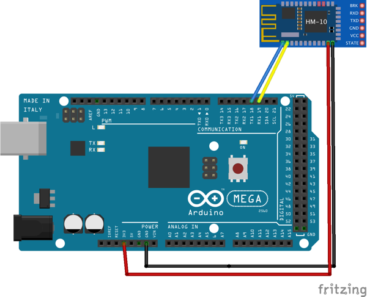
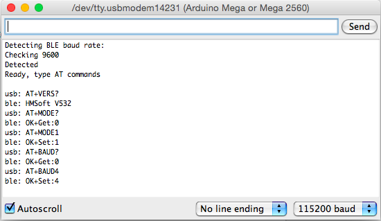

# mega-to-hm10
https://github.com/4ntoine/mega-to-hm10/

Simple sketch to use Arduino Mega2560 as USB-to-TTL converter to configure HM-10 BLE module for iOS Apploader app:
http://www.apploader.info

### Upload

1. Select 'Arduino Mega or Mega 2560' in Arduino / Tools / Board
2. Select correct Tools / Port / ...
3. Click 'Upload' button

### Usage

1. Wire Arduino board and HM-10:

  

  Arduino Mega2560 | HM-10
  ---------------- |  -----
  TX1 (pin 18)     |  UART_RX (pin 2)
  RX1 (pin 19)     |  UART_TX (pin 1)
  3.3V             |  3.3V
  GND              |  GND

2. Click 'Serial Monitor'
3. Type AT commands to configure HM-10.

A brief AT commands list is in commands.txt file.

To configure for Apploader you will need to set **mode 1** (`AT+MODE1`) and baud rate **115200** (`AT+BAUD4`).

### Example

  

Anton Smirnov, 2015